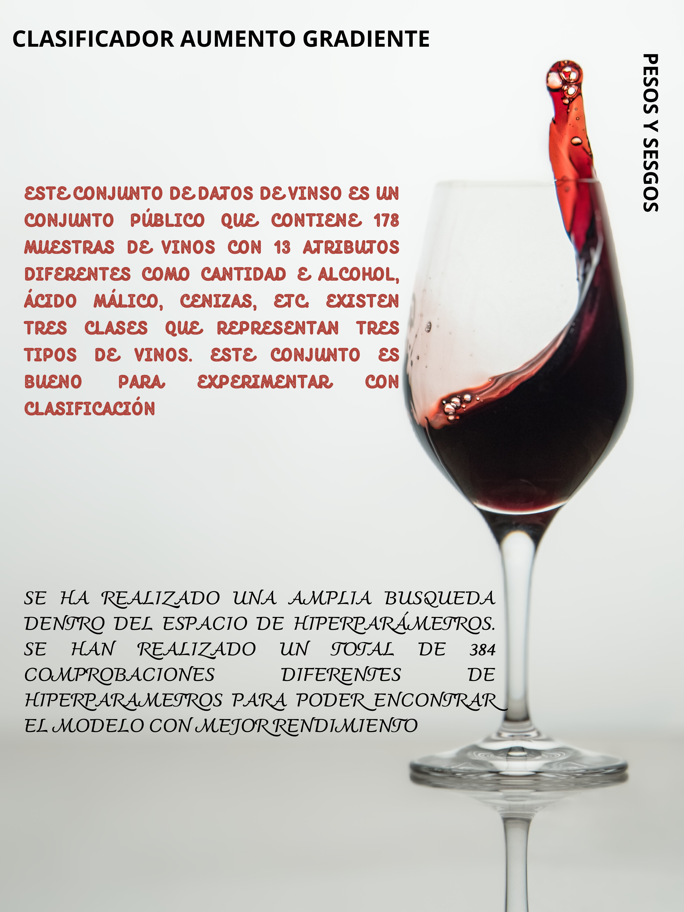

# Vinos
 
## Clasificador de aumento de gradiente para clasificación de vinos con pesos y sesgos

En este proyecto hemos utilizado los pesos y sesgos para ajustar y evaluar sistemáticamente los hiperparámetros de un clasificador de aumento de gradiente. El conjunto de datosempleado es el conjunto de datos público de Wine.

## Resultados

Los resultados obtenidos de la experimentación se pueden ver en detalle en el panel de Pesos y sesgos que adjuntamos a continuación. Esto incluye varias métricas de rendimiento, como la precisión, junto con los hiperparámetros utilizados para cada experimento.

## Descripción del problema

El problema a resolver es un ejemplo clásico de clasificación multiclase. Nuestro objetivo es predecir la categoría de vino en función de varios atributos fisicoquímicos. El conjunto de datos Wine es un conjunto público que contiene 178 muestras de vinos con 13 atributos diferentes, como contenido de alcohol, ácido málico, cenizas, etc. Hay tres clases que representan tres tipos diferentes de vinos. Es un conjunto de datos muy adecuado para experimentar con clasificación.

## Experimento

Para este proyecto, utilizamos el Clasificador de aumento de gradiente, un potente algoritmo de aprendizaje automático conjunto que se basa en árboles de decisión. Es particularmente conocido por su eficacia en problemas de clasificación.

Para encontrar el mejor modelo, exploramos varias combinaciones de hiperparámetros, como la tasa de aprendizaje, la profundidad máxima de los árboles, el número de estimadores, etc. A través de la experimentación sistemática, pretendemos comprender el efecto de estos hiperparámetros en el rendimiento del modelo y encontrar el combinación que produce los mejores resultados.

Integramos Weights & Biases en nuestro proyecto, lo que nos permite registrar los resultados para cada experimento. Weights & Biases nos proporciona un panel interactivo con el que podemos visualizar y analizar los resultados obtenidos.

## Ajuste de hiperparámetros y mejor modelo

Durante el proceso de experimentación see probaron un total de 384 combinaciones diferentes de hiperparámetros para encontrar el modelo que ofreciera el mejor rendimiento. Los hiperparámetros que ajustamos incluyen:

Tasa de aprendizaje
Profundidad máxima de los árboles.
Número de estimadores
Función de pérdida
Fracción de submuestra
Número mínimo de muestras necesarias para dividir un nodo interno
Número mínimo de muestras necesarias para estar en un nodo de hoja

Esta búsqueda exhaustiva nos permitió explorar una amplia gama de modelos e identificar la combinación de hiperparámetros que optimiza el rendimiento de este conjunto de datos específico.

El modelo con mejor puntuación logró una precisión de 0,9815 . Este alto nivel de precisión nos indica que el modelo es muy eficaz a la hora de clasificar correctamente las muestras de vino. Los hiperparámetros del mejor modelo son los siguientes:

Tasa de aprendizaje: 0,1
Función de pérdida: desviación
Profundidad máxima: 3
min_samples_leaf: 2
min_samples_split: 2
n_estimadores: 50
submuestra: 1

Esta combinación de hiperparámetros permitió que el Clasificador de aumento de gradiente capturara los patrones subyacentes en los datos de manera eficiente e hiciera predicciones muy precisas.
